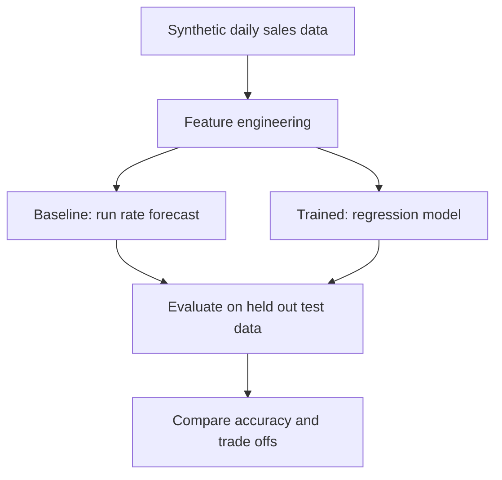

# Sales Forecast Comparison

Compares two ways to forecast end of month sales: a hand specified run rate model based on a trailing average, and a trained machine learning regression model. The goal is not to crown a winner but to show the trade offs, with feature engineering and honest evaluation on the same data.

> **Note on data:** This repository uses only synthetic, generated data. It contains no real or proprietary information. A generator script is included so anyone can reproduce the full comparison.

## Why this project

A common real world forecasting method is a run rate: take a trailing daily average and project it across the days remaining in the month. It is simple, explainable, and often good enough. The question this project asks is whether a trained model does meaningfully better, and at what cost in complexity and explainability.

Answering that honestly, rather than assuming the machine learning model wins, is itself the point. Both models are evaluated the same way on held out data.

## Approach



## The two models

**Baseline, run rate forecast.** Uses a trailing twelve period daily average, projected across the remaining days of the month. This mirrors a practical, explainable method used widely in operations. It needs no training and is easy to defend to non technical stakeholders.

**Trained, regression model.** A machine learning regression model (scikit-learn) trained on engineered features. It can capture patterns the flat average cannot, at the cost of added complexity and reduced transparency.

## Feature engineering

Raw daily sales are turned into model inputs, including:

- Calendar features such as day of week, day of month, and month
- Rolling averages over recent windows (for example 7 and 30 day)
- Lag features (sales from prior days)
- A flag separating recurring from non recurring activity

These features are what allow the trained model to learn structure beyond a simple average.

## Evaluation

Both models are scored on the same held out test period using standard regression metrics:

- **MAE** (mean absolute error), average dollars off per prediction
- **RMSE** (root mean squared error), which penalizes large misses more
- **MAPE** (mean absolute percentage error), error as a percentage of actual sales

## Results

These are real results produced by running this project on synthetic data (lower is better):

| Model | MAE | RMSE | MAPE |
| --- | --- | --- | --- |
| Run rate baseline | 1,247.54 | 1,401.53 | 34.73% |
| Trained regression | 225.19 | 277.26 | 4.71% |

The trained regression model reduced average error from about 1,248 to 225 dollars, and percentage error from roughly 35% to under 5%. The baseline struggles because a flat trailing average cannot capture the strong weekday versus weekend pattern in the data, while the trained model learns that structure from its calendar and lag features. The takeaway is not simply that the complex model wins, but why: when data has clear seasonality, features that encode it deliver most of the gain.

## Tech stack

- **Python** with pandas and scikit-learn for modeling and evaluation
- **NumPy** for numerical work
- A synthetic data generator so the full comparison is reproducible

## Repository structure

```
sales-forecast-comparison/
  README.md
  LICENSE
  .gitignore
  requirements.txt
  generate_synthetic_data.py   Creates synthetic daily sales data
  forecast_comparison.py       Builds features, runs both models, evaluates
  sample_output/
    results.csv                Example metrics output
```

## Run it yourself

**Prerequisites:** Python 3.

1. Clone this repository.
2. Install the packages: `pip install -r requirements.txt`
3. Generate sample data: `python generate_synthetic_data.py`
4. Run the comparison: `python forecast_comparison.py`
5. Review the printed metrics and `sample_output/results.csv`.

## What this project demonstrates

- Machine learning with a trained regression model
- Feature engineering from raw time series data
- Honest model evaluation with held out data and standard metrics
- The judgment to compare a simple baseline against a complex model rather than assuming the complex one is better

## License

Released under the MIT License. See the LICENSE file for details.
